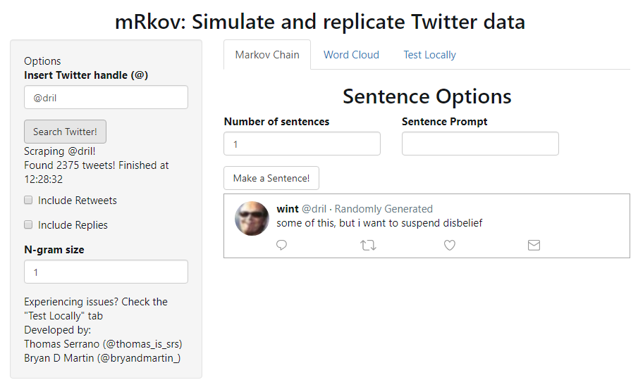

# mRkov_shiny
This is the shiny app for the R package mRkov developed by Thomas Serrano and Bryan D Martin.

The R package, mRkov can be found at the following repository: [https://github.com/serrat839/mRkov_shiny](https://github.com/serrat839/mRkov_shiny)

This package and app was developed as the result of an Rstats software development project.

## Shinyapps.io hosting
The app can be located at the following url: [https://serrat839.shinyapps.io/mRkov_shiny/](https://serrat839.shinyapps.io/mRkov_shiny/)

## Experiencing server issues?
*Right now, we are experiencing extremely high traffic that exceeds the capacities of our server!*

We are working on a fix for this issue. In the meantime, you may experience issues.

If you have R installed however, you can download the tool on your own computer and you don't need to rely on our server!

### Step 1:
`remotes::install_github("serrat839/mRkov")`
### Step 2:
`shiny::runGitHub("mRkov_shiny", username="serrat839")`

Note:
If you are installing shiny for the first time, you may run into an issue where Step 2 fails with error "Error in library(DT) : there is no package called ‘DT’".  To resolve, install DT (`install.packages("DT")`) and then rerun Step 2.
